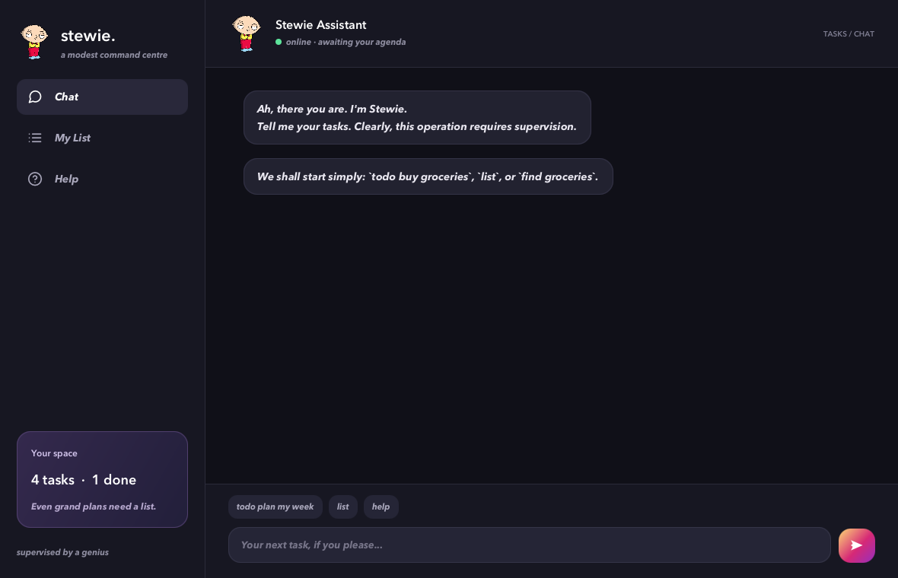

# Stewie User Guide

                ███████╗ ████████╗ ███████╗ ██╗    ██╗ ██╗ ███████╗
                ██╔════╝ ╚══██╔══╝ ██╔════╝ ██║    ██║ ██║ ██╔════╝
                ███████╗    ██║    █████╗   ██║ █╗ ██║ ██║ █████╗
                ╚════██║    ██║    ██╔══╝   ██║███╗██║ ██║ ██╔══╝
                ███████║    ██║    ███████╗ ╚███╔███╔╝ ██║ ███████╗
                ╚══════╝    ╚═╝    ╚══════╝  ╚══╝╚══╝  ╚═╝ ╚══════╝



Stewie is a personal task manager for keeping track of to-dos, deadlines, and
events. Enter short commands to record tasks, find them, update their details,
and mark them complete. Stewie saves successful changes automatically and
restores your tasks the next time you open it.

Use the desktop interface with **Chat**, **My List**, and **Help**, or manage
those same tasks through the console. This guide explains both interfaces.

## Getting started

You need **JDK 25** to run Stewie and a graphical desktop environment to use
its desktop interface.

1. Download and extract the [project source](https://github.com/winhks25/ip),
   or clone the repository if you use Git.
2. Open a terminal in the project folder containing `gradlew` and `build.gradle`.
3. Run `java -version` and check that it reports version 25. If you use SDKMAN
   with the project's JDK installed, run `sdk use java 25.0.3.fx-zulu`.
4. Start the desktop interface:

   ```sh
   ./gradlew run
   ```

   On Windows, use `gradlew.bat run`. The Gradle Wrapper is included; the first
   launch needs internet access to download build dependencies.
5. In **Chat**, type a command and press **Enter**, or click **Send**.

Example: `todo buy milk`

Stewie records your task and replies:

```text
Consider it recorded. A small triumph for competent administration.
```

Enter `list` or open **My List** to see the task.

To use the console instead, run:

```sh
./gradlew --console=plain runCli
```

On Windows, use `gradlew.bat --console=plain runCli`. Enter one command per line
and press **Enter**. Launch from the same folder each time to use the same saved tasks.

## Reading the examples

- Replace `<description>`, `<date>`, and `<number>` with your values; do not type
  the angle brackets. Square brackets in a **Format** line mean optional fields.
- Task numbers start at **1** and refer to the current full list. Run `list`
  before changing tasks, especially after searching or deleting.
- Commands and newly entered descriptions are converted to lowercase.
  Extra spaces, surrounding whitespace, and tabs are normalized.
- Unless labeled **Desktop reply**, command output blocks below show console
  output without the startup banner and greeting. Desktop results may use task
  cards and different confirmation wording.
- Examples use an English locale. Task-count digits may differ with your
  system's locale; displayed month names remain English.

Each adding example assumes an empty list. The other command examples are
independent: their starting tasks are specified in each section.

## Adding deadlines

Adds a task that must be completed by a particular date. The description and
deadline are required. Supply `/by` exactly once.

Format: `deadline <description> /by <date>`

Example: `deadline submit report /by 12/08/2026`

With an empty list, Stewie adds one unfinished deadline:

```text
Consider it recorded. A small triumph for competent administration.
[D] [ ] submit report (by: 12 Aug 2026)
Your agenda now contains 1 task. Do try to keep up.
```

**Desktop reply:**

```text
Deadline recorded. Time is now officially judging you.
```

## Adding to-dos

Adds a task without a date. A nonempty description is required.

Format: `todo <description>`

Example: `todo buy milk`

With an empty list, Stewie adds one unfinished to-do:

```text
Consider it recorded. A small triumph for competent administration.
[T] [ ] buy milk
Your agenda now contains 1 task. Do try to keep up.
```

## Adding events

Adds an event with a start date and an end date. Supply `/from` followed by
`/to`, exactly once each. The end date must be later than the start date;
same-day events and times of day are not supported.

Format: `event <description> /from <date> /to <date>`

Example: `event team meeting /from 10/08/2026 /to 11/08/2026`

With an empty list, Stewie adds one unfinished event:

```text
Consider it recorded. A small triumph for competent administration.
[E] [ ] team meeting (from: 10 Aug 2026 to: 11 Aug 2026)
Your agenda now contains 1 task. Do try to keep up.
```

**Desktop reply:**

```text
Event scheduled. I trust the occasion warrants all this organisation.
```

## Listing tasks

Shows every task in its current order, including completed tasks, with the
numbers used by `mark`, `unmark`, `update`, and `delete`.

Format: `list`

Example: `list`

If you added `buy milk`, `team meeting`, and `submit report` in that order using
the commands above, the console shows:

```text
Behold, your agenda. Let us examine the scale of this undertaking.
1. [T] [ ] buy milk
2. [E] [ ] team meeting (from: 10 Aug 2026 to: 11 Aug 2026)
3. [D] [ ] submit report (by: 12 Aug 2026)
```

`[T]` means to-do, `[E]` means event, and `[D]` means deadline.
`[ ]` means unfinished; `[X]` means completed. In Chat, tasks appear as cards.

## Finding tasks

Finds tasks whose displayed text contains at least one supplied keyword.
Partial matches are allowed: `milk` also matches `milkshake`. Multiple keywords
mean **any keyword**, rather than all keywords together. Completed tasks can
appear in search results.

Format: `find <keyword> [more keywords]`

Example: `find milk report`

With the three tasks from the listing example, the console shows:

```text
Behold, your agenda. Let us examine the scale of this undertaking.
1. [T] [ ] buy milk
2. [D] [ ] submit report (by: 12 Aug 2026)
```

**Search results have their own numbering.** Here, `submit report` is result 2
but remains task 3 in the full list. Enter `list` before using a numbered
command. Search cards in Chat do not provide task-changing controls.

Use description keywords for predictable matches. Search also examines the
displayed type, status, and dates, but input is lowercased while those labels
and month names may contain uppercase letters.

When nothing matches, the console shows:

```text
Behold, your agenda. Let us examine the scale of this undertaking.
No tasks to show. How suspiciously serene. Try adding a task or checking your search.
```

In Chat, the empty-search reply is:

```text
Nothing matches. Even my brilliance needs a clue. Try another keyword or `list`.
```

## Marking tasks as complete

Marks a task as done without deleting it.

Format: `mark <number>`

Example: `mark 2`, followed by `list`

Starting with the three unfinished tasks from the listing example, the event
becomes completed. Successful `mark` commands print no console confirmation;
the following `list` shows the change:

```text
Behold, your agenda. Let us examine the scale of this undertaking.
1. [T] [ ] buy milk
2. [E] [X] team meeting (from: 10 Aug 2026 to: 11 Aug 2026)
3. [D] [ ] submit report (by: 12 Aug 2026)
```

In Chat, Stewie confirms completion and displays the revised task list.
You can also use a task's checkbox in the latest Chat list or in **My List**.

## Reopening completed tasks

Marks a completed task as unfinished so you can work on it again.

Format: `unmark <number>`

Example: `unmark 2`, followed by `list`

Starting with the three tasks above and the event completed, the event becomes
unfinished. Successful `unmark` commands print no console confirmation; the
following `list` shows:

```text
Behold, your agenda. Let us examine the scale of this undertaking.
1. [T] [ ] buy milk
2. [E] [ ] team meeting (from: 10 Aug 2026 to: 11 Aug 2026)
3. [D] [ ] submit report (by: 12 Aug 2026)
```

In the desktop interface, you can also uncheck a completed task's checkbox.

## Updating tasks

Changes a task's description, dates, or both. Its type and completion status
stay the same, and omitted fields keep their current values.

Format: `update <number> [description] [d/<date>] [from/<date>] [to/<date>]`

Supply at least one replacement field. Put a replacement description before
the date fields. Each field can appear only once.

| Task type | Fields you can change |
| --- | --- |
| To-do | Description only |
| Deadline | Description and `d/<date>` or `by/<date>` |
| Event | Description, `from/<date>`, and `to/<date>` |

`d/` and `by/` are aliases; do not supply both. Creation commands use `/by`,
`/from`, and `/to`, whereas update commands use `d/`, `by/`, `from/`, and `to/`.

Example: `update 3 file report d/20/08/2026`

Starting with the three unfinished tasks from the listing example, Stewie
renames the deadline and changes its date:

```text
Revised to your specifications. Yes, even that detail.
[D] [ ] file report (by: 20 Aug 2026)
```

Other examples for those starting tasks:

- `update 1 buy bread` changes only the to-do's description.
- `update 3 by/20/08/2026` changes only the deadline's date.
- `update 2 planning meeting from/15/08/2026 to/16/08/2026` changes the event's
  description and both dates.

An update cannot convert a to-do into a deadline or event. An invalid update,
such as an event end date before its start date, leaves the original task intact.

## Deleting tasks

Removes a task and saves the change. Remaining tasks are renumbered.
There is no undo command or deletion confirmation prompt.

Format: `delete <number>`

Example: `delete 1`, followed by `list`

Starting with the three unfinished tasks from the listing example, Stewie
removes `buy milk`. Successful `delete` commands print no console confirmation;
the following `list` shows:

```text
Behold, your agenda. Let us examine the scale of this undertaking.
1. [E] [ ] team meeting (from: 10 Aug 2026 to: 11 Aug 2026)
2. [D] [ ] submit report (by: 12 Aug 2026)
```

In Chat, you can also use the delete button on a task card in the latest full
list. Check the refreshed list before acting on another task.

## Using My List

The desktop **My List** view separates **Unfinished** and **Completed** tasks.
Cards retain their full-list numbers, even when there are gaps in a section.

Example: Open **My List** and check an unfinished task's circular checkbox.

The task is saved as complete and the sidebar count updates immediately.
Its card dims for about three seconds, then moves to **Completed**. Uncheck it
in **Completed** to move it immediately back to **Unfinished**. You can also
focus a checkbox with **Tab** and press **Space** to change it.

When no unfinished tasks remain, the view shows:

```text
No unfinished tasks. Remarkable. Add a task in Chat when ambition returns.
```

Switching between Chat, My List, and Help preserves the conversation and any
unsent Chat input. Suggested commands in Chat are sent immediately when clicked.
If you use an old Chat card after tasks have changed, Stewie refreshes the list;
use the new card to perform the action.

## Getting help

Shows the command reference in the desktop interface. Click **Help** in the
sidebar or enter `help` in Chat. The console does not support `help`; use this guide.

Format: `help` (desktop only)

Example: `help`

The reference begins with this introduction, followed by command formats and
date examples:

```text
The instructions. A brief reading should spare us both a great deal of theatre.
```

## Exiting Stewie

Ends a console session. In the desktop interface, `bye` displays a farewell;
close the window to exit. Changes are already saved after each successful
action, so there is no separate save command.

Format: `bye`

Example: `bye`

Stewie replies:

```text
Very well. Do come back. I mean, someone must supervise your progress.
```

## Entering dates and descriptions

These formats all represent the same date:

```text
2026-08-12
12/8/2026
12-8-2026
12.8.2026
12 Aug 2026
12 August 2026
Aug 12, 2026
August 12, 2026
```

Numeric dates with slashes, dots, or day-first hyphens use **day, month, year**.
Dates must exist in the calendar and have a year from 0001 to 9999. Times,
relative dates such as `tomorrow`, and same-day event ranges are not supported.
Dates display as `12 Aug 2026` regardless of the accepted input format.

Descriptions cannot be empty or contain `|` or control characters. Use the
documented field markers only for their intended fields; unknown or repeated
markers in deadline, event, and update commands are rejected.

Tasks with the same type, description, and dates are duplicates, even when one
is completed. Letter casing and repeated whitespace do not distinguish them.
Use `update` to change an existing task or `unmark` to reopen it.

Example: `deadline report /by 2026-02-30`

February 30 is not a valid date. Stewie adds no task and explains:

```text
A slight flaw in your plan: Use a real calendar date, such as 2026-08-28 or 28/8/2026 (dates only).
```

## Saving and recovering tasks

Stewie stores tasks in `data/stewie.txt`, relative to the folder from which you
launch the application. A missing file is created on the first successful task
change. Both interfaces use this storage location.

To back up your tasks, close Stewie and copy `data/stewie.txt` to a safe location.
To restore a backup, close Stewie, preserve a copy of the current file, replace
it with the backup, and restart from the same launch folder. Restoring a backup
returns the task list to the state recorded in that file.

| Problem | What to do |
| --- | --- |
| Tasks seem to have disappeared | Check that you launched from the same folder and that its `data/stewie.txt` is your usual task file. |
| Invalid or duplicate records at startup | Stewie reports the affected line numbers and makes valid tasks available read-only. Close Stewie, back up the file, repair the reported records or restore a valid backup, and restart. |
| Unable to read the task file | Check that the path is a regular file, that you have read permission, and that its contents use UTF-8. Fix the problem and restart. |
| Unable to save tasks | The requested change was not applied. Check file and folder write permissions, free space, and filesystem support for atomic file replacement, then retry. |
| Task file changed outside Stewie | Restart to load the changed file before editing tasks. Avoid editing the file or running a second instance against the same file while Stewie is open. |

Read-only mode lets you inspect available tasks with `list` and `find`, but
blocks additions, updates, status changes, and deletions. A blocked change reports:

```text
Tasks are read-only. Back up and repair the task file, then restart.
```

For manual repair, the file has one task per line. Fields are separated by `|`;
status `0` means unfinished and `1` means completed. For example:

```text
T | 0 | buy milk
D | 0 | submit report | 12 Aug 2026
E | 1 | team meeting | 10 Aug 2026 | 11 Aug 2026
```

Preserve the field order and use valid dates and unique task details. Prefer
the application's commands for routine edits.

## Command summary

| Action | Format |
| --- | --- |
| Add a deadline | `deadline <description> /by <date>` |
| Add a to-do | `todo <description>` |
| Add an event | `event <description> /from <date> /to <date>` |
| List all tasks | `list` |
| Find tasks | `find <keyword> [more keywords]` |
| Complete a task | `mark <number>` |
| Reopen a task | `unmark <number>` |
| Update a task | `update <number> [description] [d/<date>] [from/<date>] [to/<date>]` |
| Delete a task | `delete <number>` |
| Show desktop help | `help` |
| Say goodbye; exit the console | `bye` |
